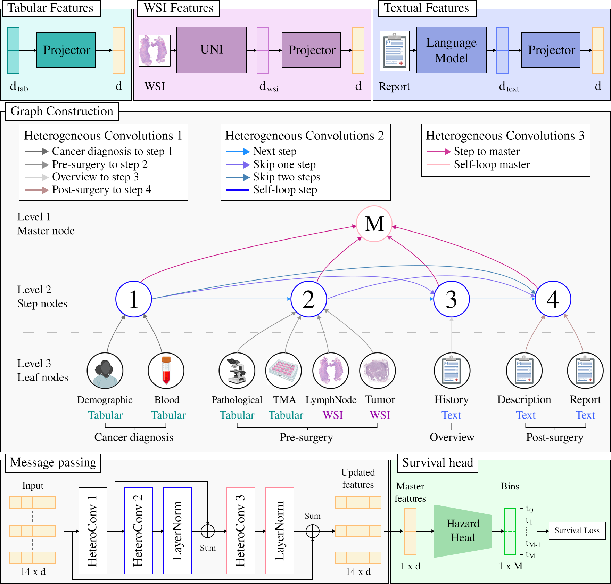

<p align="center">
  <h2 align="center">[MIDL 2026] Replicating Patient Follow-Up with Hierarchical Directed Graphs for Head and Neck Cancer Survival Analysis 🧪🔬🎯</h2>
</p>

📄 Official implementation for the **paper submitted for MIDL 2026**: [arXiv submission](https://arxiv.org/abs/2404.06207)

---

### 🧩 Method Overview

We propose **H2DGSurv** (Hierarchical Heterogeneous Directed Graph), a Graph Neural Network architecture for multimodal survival prediction that models the clinical pathway as a directed heterogeneous graph with temporal progression.

<p align="center">
  
</p>

---

### 🚀 Getting Started

#### Installation

**Requirements:** Python 3.12+

```bash
# Clone the repository
git clone https://github.com/dpmc-lab/h2dg-surv.git
cd h2dg-surv

# Install dependencies
pip install -r requirements.txt
```

#### 📂 Dataset Preparation

1. Download the [HANCOCK dataset](https://www.hancock.research.uni-erlangen.org/download)
2. Place it in `./data/HANCOCK/`

#### Splits Preparation

**Option 1: Download pre-computed splits from Hugging Face**

Download the splits directly from our [🤗 Hugging Face repository](https://huggingface.co/dpmc/h2dg-surv)

Place the downloaded `folds_5.csv` in `./data/HANCOCK/Split/`

**Option 2: Generate splits from scratch**

```bash
python main.py folds --data_root ./data/HANCOCK --n_folds 5 --random_seed 42
```

#### Dataset Structure

```
data/HANCOCK/
├── StructuredData/
│   ├── clinical_data.json
│   ├── blood_data.json
│   └── pathological_data.json
├── TextData/
│   ├── histories_english/
│   ├── surgery_descriptions_english/
│   └── reports_english/
├── TMA_CellDensityMeasurements/
│   └── TMA_celldensity_measurements.csv
├── WSI_LymphNode/
│   └── h5_files/
├── WSI_PrimaryTumor/
│   └── WSI_PrimaryTumor_*/
└── Split/
    └── folds_5.csv
```

---

### Training

#### Basic Usage

```bash
python main.py train --config config/train/hdhg.yaml

# For all available options:
python main.py train --help
```
---

### Evaluation

```bash
python main.py eval --checkpoint-dirs [checkpoint-dirs]
```

---

### 🙌 Acknowledgments

We acknowledge [Kist et al. 2024](https://www.nature.com/articles/s41597-024-03596-3) for making the HANCOCK dataset available.

### Useful Links

- [HANCOCK Challenge](https://www.hancock.research.uni-erlangen.org/download)
- [BioClinicalBERT](https://huggingface.co/emilyalsentzer/Bio_ClinicalBERT)

---

### 🔗 Citation

> [!IMPORTANT]  
> This project is based on the work by Miccinilli and Di Piazza 2025. If you use this code in your research, we would appreciate reference to the following paper:

```BibTeX
@inproceedings{mcdp2025h2dg,
  author    = {Hugo Miccinilli and Theo Di Piazza},
  title     = {Replicating Patient Follow-Up with Hierarchical Directed Graphs for Head and Neck Cancer Survival Analysis},
  booktitle = {Arxiv preprint},
  year      = {2025},
}
```
